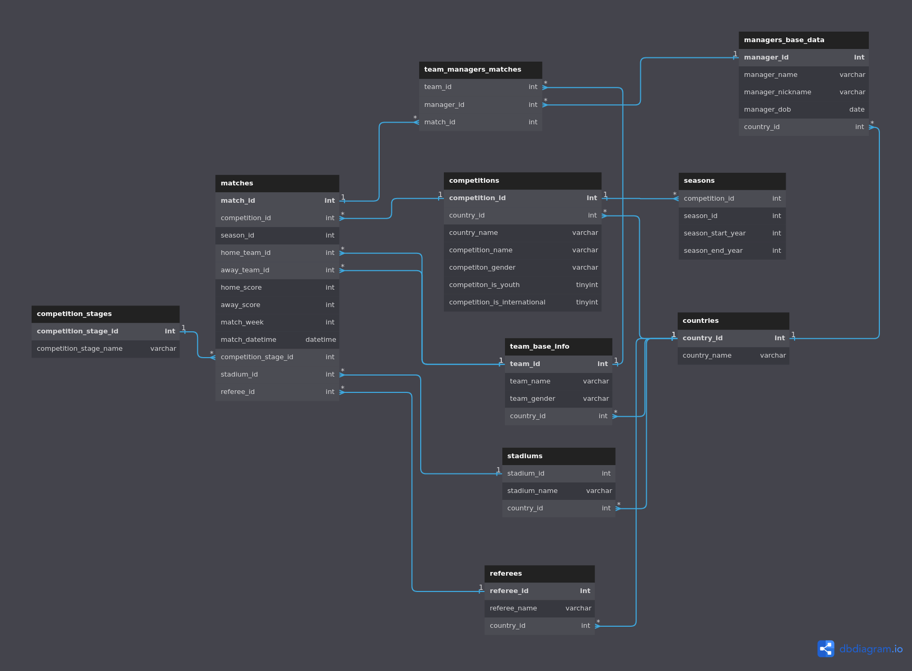

# 
Data engineering project: ETL data migration between mongoDB and mySQL.

## Project description

### End goal
- ETL data migration between mongoDB and mySQL, using highly nested JSON files as data source.

### Dataset of choice
- [Statsbomb open data](https://github.com/statsbomb/open-data)
- Data guide can be found at [documentation/data_guide.md](documentation/data_guide.md)

## Project implementation

### Technology stack used
1. `Python` -> for data extraction from mongodb, transformation, and loading into mySQL.
2. `MongoDB instance hosted on mongoDB Atlas` -> for storing the raw data. (not actually raw, as it was processed a bit, please refer to [documentation/data_guide.md](documentation/data_guide.md) for more details)
3. `mySQL instance hosted on GCP` -> for storing the transformed data.
4. `SQL` -> for creating the barebone of the database schema (tables, which columns in each table, which data type for each column, primary key, foreign key, etc.)

### code structure
you'll find all the code to be in the `code` directory, it will have:
- [`helpful_funcs.py`](code/helpful_funcs.py) -> contains some basic functions that are used throughout the project.
- [`porting_json_to_mongo.py`](code/porting_json_to_mongo.py) -> contains the code to port the raw json files into mongoDB. (this is a one time thing, so it's not really a part of the ETL process)
- [`mongodb_downloader.py`](code/mongodb_downloader.py) -> contains the code to download a full collection from mongoDB as a dict.
- [`json_data_parser_funcs.py`](code/json_data_parser_funcs.py) -> this is the bread and butter of the transformation process, it contains functions that can process the JSON data into mutiple pandas dataframes, which mimic the SQL database schema.
- [`mysql_db_funcs.py`](code/mysql_db_funcs.py) -> contains functions that can create the database schema using raw SQL as read from the [../sql_files/](../sql_files/) directory.
- [`main.py`](code/main.py) -> combines all the above functions into a single script that can be run to perform the ETL process.
- [`sql_files/database_schema_creation_commands.sql`](code/sql_files/database_schema_creation_commands.sql) -> contains the SQL commands to create the database schema (creation of tables, fields, and their datatypes, primary keys, not null constraints, etc.)
- [`sql_files/database_foreign_keys.sql`](code/sql_files/database_foreign_keys.sql) -> contains the SQL commands to create the foreign keys between the tables in the database schema. (this is done after uploading the tables to the mySQL database, as this will lead to more complexity in the upload process, and it's not really needed to be done before uploading the tables)

## Final database schema

> you can click on the image to go to the interactive version of the ERD.

## Database access
- this repo won't run on its own, please contact me if you want to access the database, and I'll provide you with the credentials.

## Areas of improvement
- Could dive deeper into the other collections in mongodb
- Could add more tables to the database schema
- Code could be run on a cloud computing service instead of locally
- Code create some SQL views to show winning teams in each match, and other metrics
- Could add more comments to the code 